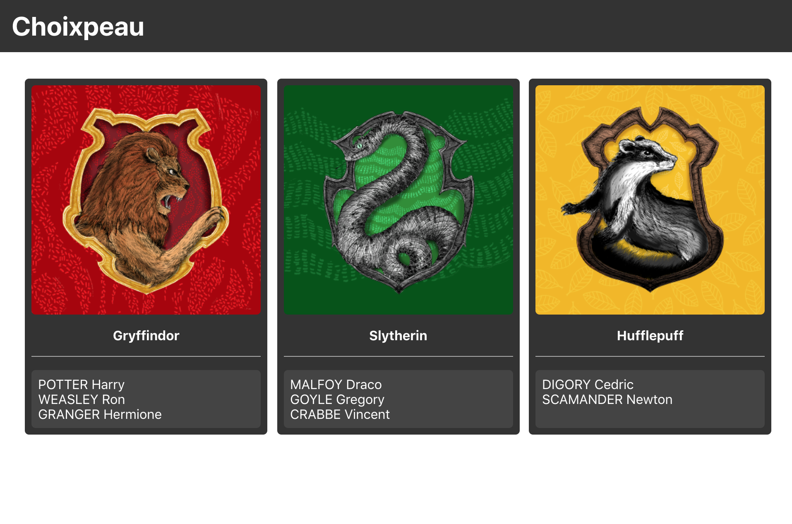

# Étape 2

Maintenant que vous êtes familier avec l'architecture du projet, il est temps de rentrer dans le vif du sujet : la
création de composants. Pour ce faire nous allons voir en premier le code minimal pour une application React et
analyser ce qu'il s'y passe afin de mieux comprendre la manière dont fonctionne les composants React.

## Hello World !

Le code minimal pour démarrer une application React est le suivant :

```js
import React from 'react';
import ReactDOM from 'react-dom';

ReactDOM.render(
  React.createElement('h1', { children: 'HellowWorld!' }),
  document.querySelector('#root'),
);
```

Ci-dessus on peut observer un certain nombre de chose mais dans un premier temps nous allons nous attarder
particulièrement sur `React.createElement`. En effet cette fonction permet de générer un élément React qui servira de
"descriptif" à React pour savoir quoi afficher dans la page. Dans notre exemple on peut voir que l'on souhaite afficher
à l'écran une balise `<h1>` avec la contenu `HellowWorld!`.

Cette traduction est effectuée par `ReactDOM` qui s'occupe de traduire les éléméents React en éléments DOM. Il existe
à l'heure actuelle une bonne quantité de "traducteurs" qui permettent d'utiliser React sur de nombreuses plateformes,
par exemple React Native.

## JSX

Décrire le rendu de la page avec `React.createElement` peut vite être laborieux à lire et écrire, c'est pour quoi,
Facebook a décidé d'introduire une nouvelle syntaxe appellée le JSX.

```jsx harmony
ReactDOM.render(
  <h1>HelloWorld!</h1>,
  document.querySelector('#root'),
);
```

Cette syntaxe permetant d'écrire du "HTML" dans votre JavaScript rend React très déclaratif, et permet de créer
des comportements très dynamique sans avoir des symbols spécifiques dans votre templatre pour le faire. En effet vous
profitez de toute la puissance du JS pour créer le template comme bon vous semble.

L'intérieur des balises JSX représentent ce que l'on appel les `children`. On peut en effet, retourner d'autres
éléments React en temps qu'enfant pour créer une arborescence comme en HTML. Pour rendre le contenu dynamique, ils vous
suffit d'utiliser la syntaxe suivante :

```jsx harmony
const someValue = 'foo'

ReactDOM.render(
  <h1>My variable is: {someValue}</h1>,
  document.querySelector('#root'),
);
```

A l'intérieur des `{}` en JSX vous pouvez utiliser absolument n'importe quelle expression JavaScript qui retourne un
résultat. Pour créer des listes on écrira donc :

```jsx harmony
const myList = ['foo', 'bar'];

ReactDOM.render((
  <ul>
    {myList.map(value => <li>{value}</li>)}
  </ul>
), document.querySelector('#root'));
```

## Mettre à jour des éléments

Les éléments React sont immutables, cela veut dire qu'ils ne peuvent jamais être modifié, ils sont une image de l'état
de l'application à un instant T. Pour modifier le rendu de la page il vous sera donc nécéssaire de recréer de nouveaux
éléments. Par exemple pour une horloge :

```jsx harmony
function tick() {
  ReactDOM.render((
    <div>
      <h1>Clock</h1>
      <h2>It is {new Date().toLocaleTimeString()}.</h2>
    </div>
  ), document.querySelector('#root'));
}

setInterval(tick, 1000);
```

Il ne faut pas se soucier de l'impact potentiel que cela pourrait avoir sur les performances de tout recréer à chaque
fois car React s'occupe automatiquement de détecter les changements et n'applique uniquement au DOM les éléments
modifiés.

## Les composants

Lorsque votre application grossie et que vous rajoutez de plus en plus de fonctions, vous allez vite vous rendre compte
que tout mettre dans un seul fichier avec `ReactDOM.render` n'est pas possible. C'est pour pouvoir découper le code et
le réutiliser que les composants existent. Ils se présentent sous cette forme :

```jsx harmony
class MyComp extends React.Component {
  render() {
    const { title, content } = this.props;
    return (
      <article>
        <h2>{title}</h2>
        <div className="article-content">
          {content}
        </div>
      </article>
    );
  }
};
```

Vous avez déjà dû aprercevoir cela dans le fichier `App.js`, les composants sont des classes ou des fonctions qui
possèdent une méthode de rendu qui prends en paramètre des `props` et qui retourne des React elements.

Si votre composant n'est constitué que d'une fonction de rendu, vous pouvez l'écrire sous la forme ci-dessous :

```jsx harmony
const MyComp = ({ title, content }) => (
  <article>
    <h2>{title}</h2>
    <div className="article-content">
      {content}
    </div>
  </article>
);
```

Pour afficher un composant React, rien de plus simple par rapport aux éléments DOM classique :

```jsx harmony
ReactDOM.render(
  <MyComp title="Test" content="I'm an awesome article" />,
  document.querySelector('#root'),
);
```

Tous les attributs JSX donnés au composant seront passés en un seul objet `props` à cleui-ci. Cet objet est lui aussi
immutable, les props ne peuvent en aucun cas être modifiées par le composants à qui elles sont données.

Les composants peuvent être imbriqués les uns dans les autres exactement de la même manière que les éléments DOM.

## Fragments

Il arrive souvent que vos composants React renvoient plusieurs composants ou élément. Vu que les composants ne peuvent
renvoyer qu'un seul élément React et que vous n'avez pas forcément envie de créer une `div` inutile pour les entourer,
il existe un composant `Frgament` qui permet de faire ça. En effet `Fragment` ne génère aucun node HTML. Par exemple :

```jsx harmony
const MyComp = () => (
  <Fragment>
    <h2>Foo</h2>
    <div className="article-content">Bar</div>
  </Fragment>
);
```

Aura pour sortie :

```html
<h2>Foo</h2>
<div className="article-content">Bar</h2>
```

Vous pouvez aussi écrire `<></>` à la place d'importer `Fragment`.

## Mise en pratique

Maintenant que vous possédez toutes les informations pour créer vos premiers composants, nous allons donc créer
l'interface de notre Choixpeau. Pour ce faire, nous auront besoin des composants suivants :

- AppBar : Barre de navigation affichée en haut de la page qui contiendra le titre de l'application.
- HousesList : Liste des maisons à Poudlard sous forme de colones contenant le nom et l'image de la maison ainsi que la
liste des étudiants qui lui sont assignés.
- StudentsList : Liste d'étudiants qui prend en propriété la liste des étudiants à afficher.

Commencez par créer un nouveau fichier dans le dossier `src` pour chaque nouveau composant. Une fois
vos composants terminés, ajoutez-les dans le rendu du composant `App`.

Les données des maisons/étudiants peuvent être récupérées depuis les fichiers `./src/data/houses.json` et
`./src/data/students.json` via un simple `import`.

Ajoutez ensuite du CSS pour arriver au rendu ci-dessous en créant des fichiers CSS que vous importerez
dans vos composants.



_Astuce : Les éléments DOM possèdent un attribut spécial `className` qui permettent de configurer la classe CSS d'un
élément (`class` étant un mot clé JavaScript réservé)._

## Étape suivante

Maintenant que vous êtes en mesure de créer des composants React, nous allons apprendre à gérer leur cycle de vie et
leurs états internes. Rendez-vous à l'étape suivante avec la commande :

```
yarn next-step
```
